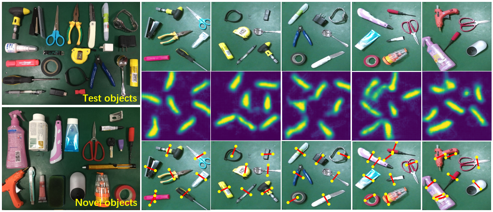

#  Deep Multi-Grasp Detection Network via Augmented Heatmap Regression

## Platform

* **Ubuntu 16.04**  ```pytorch1.0.1``` ,```python3.6``` ,```cuda-9.0``` on ```GTX1080Ti``` 
* **UR5 Robot** equipped with **Kinect-v2** and **Custom Compliant Gripper**


## Introduction

​	We focus on multi objects scene (like the image below) where detecting multiple grasping configurations from a **RGB** image simultaneously is more efficient and adaptable in various environments compared to single grasp detection.

​	Fully-connected layers before regression of the grasp configuration composed of 5 elements $(p_{x},p_{y},\theta,w,h)$ is commonly used in this issue.However, fully-connected layers are well-known for it's poor performance in visual spatial detection tasks, which is fatal to precise grasp.Here, we propose a novel and efficient method called **Augmented Heatmap Regression** to tackle this problem. Experiments showed that this method is effective to maintain the crucial spatial information. In the meantime, it showed strong generalization ability on novel objects.

​                      	 

​	The regular heatmap regression, often a 2d gaussian map is often generated around a point $(p_{x},p_{y})$ in pixel coordinates with variance $\sigma$, which produce two spatial parameters. In order to represent a grasp configuration completely, an additional angle information $\theta$ is used in augmented heatmap regression. Therefore,we get the vector $(p_{x},p_{y},\theta)$, which we think is enough for a successful grasp.

​              

​            

​		We refer to Stacked Hourglass Network in [the paper](https://arxiv.org/pdf/1603.06937.pdf) which is a top-down and bottom-up feature assemble network designed for human pose estimation. Here we don't stack it, that is we only use a single Hourglass Network as our detection model. In this model, a RGB image containing multi objects is input and several single heatmaps are output,  the highlighted area of which represents a grasping configuration candidate. After post processing, grasping configurations can be extracted.  To be noted, the post processing can be finished in many ways, here we only show one of that in the file ```post_utils.py```. 

​		We also offer a [multi-grasp detection dataset](http://xxx) which contains more than 2000 images with up to 14000 qualified grasping annotations for 22 different objects, which you can use to train or test. Do data augmentation if you would like, which is convenient because the input and output are both images. In our test, we didn't do that.

## Train

​		Although we uploaded the model we trained, you can also train your own model from scratch very easily.  Download our dataset and unzip it in your work path. Do 

```python train.py``` 

and start training process. We recommend that you'd better early stop it before the loss go up.

## Test

​		The model we uploaded or you train from scratch yourself are both OK for test. We offer several images in ```./MultiGraspDataset/valid/``` including test objects(objects in the training dataset) and novel objects(objects not in the training dataset).Do 

```python test.py --mode test(or novel)```. 

```cd ./MultiGraspDataset/valid/test(or novel)/compare/```

you will get the test result like below. Feel free to split the training dataset for extended validation.

## Real Experiments

​		We do the real experiments on UR5 robot equipped with Kinect-v2 and custom compliant gripper. Refer to the codes in ```RealExp.py``` and ```HandCtrl/``` .